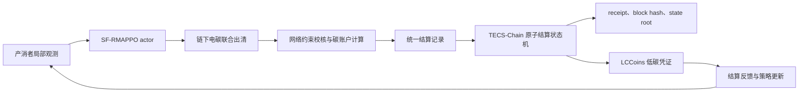

# 面向 P2P 能源交易的可信电碳协同结算反馈框架

## 摘要

分布式光伏、储能和柔性负荷的大规模接入正在推动配电系统由集中供能模式转向产消者参与的点对点能源交易模式。现有 P2P 电碳联合交易研究通常分别处理电量出清、碳责任核算、区块链记录和强化学习策略优化，可信结算结果多停留在事后记录层面，尚未充分转化为能够持续影响后续交易策略的可验证低碳反馈信号。为解决这一问题，本文提出可信电碳协同结算反馈框架 TECSF，将链下电碳联合出清、可信结算状态机、LCCoins 低碳激励凭证和结算反馈驱动的循环多智能体近端策略优化算法组织为闭环机制。该框架首先根据产消者购售电申报、报价和储能动作完成双边撮合与网络约束校核，随后在本地 TECS-Chain 结算状态机中以统一结算记录同步确认电量支付、碳市场条目和 LCCoins 铸造，并在哈希错误、约束越限、执行失败或重复铸造时拒绝或回滚结算。已确认的 LCCoins 与电碳结算结果共同进入强化学习反馈，使低碳奖励不再仅来自预设环境参数，而是来自可审计的结算状态。基于 5 个随机种子、1000 episode 训练和 20 episode 固定策略评估的重新实验表明，TECSF 在主对比实验中实现 1.000 的结算成功率和 0.000 的最大约束违背，相比无 LCCoins 消融将平均回报由 -0.305 提升至 -0.266，并产生 36.72 的 LCCoins 反馈；逐主体行为指标显示，LCCoins 与候选低碳凭证完全一致，与低碳电量贡献的相关系数为 0.969。结算压力测试中 30 个异常注入 case 全部通过，能量余额、碳余额和 LCCoins 余额最大回滚误差均为 0。进一步的网络压力、可扩展性以及 IEEE 33-bus 和 IEEE 69-bus 标准配电网算例表明，修复后的实验管线均满足结算成功率和最大约束违背验收门槛，但 TECSF 的经济成本和碳排放并不全面优于确定性基线。总体而言，实验结果支持 TECSF 在可信结算、约束安全和低碳反馈闭环方面的有效性，但不支持将其表述为所有经济与碳排放指标上的全局最优方法。

**关键词：** P2P 能源交易；电碳协同结算；可信结算状态机；LCCoins；多智能体强化学习；MAPPO；配电网约束

## 1 引言

分布式能源、用户侧储能和智能负荷的快速发展正在改变配电系统的运行方式。传统配电网中，用户通常作为被动负荷接受集中供电，而在高比例分布式光伏和储能接入后，用户既可能消费电能，也可能在局部时段向邻近用户出售富余电能，因而逐渐转变为具有主动交易能力的产消者。P2P 能源交易允许产消者直接交换本地电能，有助于提高可再生能源就地消纳、降低主网购电依赖并增强用户侧灵活性。随着电力系统低碳转型持续推进，P2P 交易目标也从单一电量收益优化扩展为电量交易、碳责任确认、碳配额履约和低碳激励的协同优化问题。

已有研究从不同角度推进了 P2P 能源交易与碳市场耦合。Hua 等提出基于区块链的能源与碳市场一体化 P2P 交易框架，强调电能交易和碳排放许可流转需要可追溯记录 [1]。Lu 等将碳感知配电节点边际价格引入 P2P 电力与碳联合交易，说明节点位置、潮流约束和碳责任会共同影响交易价格 [2]。Ma 等进一步在配电网中研究电碳耦合 P2P 交易，通过碳排放流和优化模型刻画交易行为对碳责任的影响 [3]。碳上限交易、低碳需求响应、差分隐私和储能参与下的电碳共享机制也被用于刻画产消者在碳约束下的交易偏好 [4]-[6]。这些研究表明，低碳 P2P 交易已经不再是简单的电量匹配问题，而是需要同时处理经济收益、物理网络约束和碳责任归属的复合交易问题。

多智能体强化学习为动态 P2P 交易提供了重要方法基础。在可再生出力、负荷需求、电价、碳价和储能状态均随时间变化的环境中，产消者需要连续决策其购售电量、报价和储能充放电策略。联邦强化学习已被用于智能建筑的 P2P 能源与碳配额联合交易 [7]，多智能体深度强化学习也被用于多微网能碳联合交易、光伏储能 P2P 交易和多能源微电网协同调度 [8]-[10]。本地能源市场中的协同交易与灵活性服务、区域互联微电网能量管理、可扩展多簇交易协调和分层住户社区交易机制进一步说明，P2P 策略学习需要同时处理主体耦合、局部观测、跨时段资源调度和规模扩展问题 [15]-[18]。这类方法能够将碳成本或低碳目标写入奖励函数，但其低碳反馈通常由仿真环境直接计算或由设计者预设，尚未充分体现交易结算之后经可信确认的碳责任与低碳贡献。换言之，智能体往往学习的是模型内生奖励，而不是已经被交易系统确认并可审计追踪的低碳贡献。

区块链和智能合约为 P2P 能源交易提供了去中心化记录、自动执行和可信追溯能力。除能源与碳市场一体化链上交易外，已有研究还将区块链与软件定义网络、激励兼容机制和去中心化 P2P 交易架构结合，以提高交易透明性和参与激励 [11], [12]。与此同时，网络约束下的 P2P 出清机制从博弈论、分布式优化和对偶上升等方向证明，P2P 交易必须满足电压、电流和线路容量等配电网安全约束 [13], [14]。硬件在环验证和保持主体独立性的网络约束交易研究也表明，可实施的 P2P 机制不能只追求交易收益，还必须同时考虑真实运行环境、代理自治性和配电网安全边界 [19], [20]。然而，在多数框架中，区块链仍主要承担交易记录或支付执行功能，链下电碳联合出清、碳责任确认、可信结算和策略学习之间尚未形成统一闭环。若电量收益、碳责任和低碳奖励分别由不同模块异步处理，产消者可能获得电量收益却未同步承担碳责任，也可能在低碳贡献未经确认时提前获得激励。

基于上述问题，本文关注的核心问题是：如何将 P2P 电碳联合交易中的可信结算结果转化为能够持续影响后续策略学习的低碳反馈信号。该问题面临三方面挑战。首先，电量支付、碳责任确认和低碳凭证生成必须在同一交易状态下原子确认，否则会出现收益确认与责任履约脱节。其次，低碳激励必须与已确认结算结果绑定，避免仅依赖外部补贴参数或环境内生奖励。最后，强化学习策略更新需要同时处理结算反馈滞后、产消者耦合动作、储能跨时段状态和配电网运行约束，不能简单依赖无约束策略搜索。

本文提出 TECSF 框架来解决上述问题。与将完整优化过程部署到真实区块链网络中的方案不同，TECSF 将区块链层抽象为本地可审计的链式结算状态机，用于验证结算记录、生成 receipt、维护 block hash 和 state root，并在失败时执行原子回滚。本文的贡献主要体现在以下三个方面。第一，构建链下电碳联合出清、TECS-Chain 可信结算、LCCoins 激励和 SF-RMAPPO 策略学习组成的闭环框架，使低碳反馈来源从预设奖励转向已确认结算结果。第二，设计统一结算记录和原子状态转换机制，将电量支付、碳市场条目和 LCCoins 铸造绑定到同一结算事务中，支持哈希校验、约束越限拒绝、执行失败回滚和重复铸造防护。第三，在多智能体 PPO 中引入循环 actor、集中式 critic、结算反馈输入和拉格朗日约束惩罚，通过多种子、消融、网络压力、结算压力、可扩展性以及 IEEE 33/69 标准配电网算例验证方法的作用边界。

## 2 问题建模与系统框架

考虑一个含分布式光伏、储能和柔性负荷的径向配电网 P2P 交易场景。设配电网节点集合为 $\mathcal{B}$，线路集合为 $\mathcal{L}$，产消者集合为 $\mathcal{N}$，交易时段集合为 $\mathcal{T}$。产消者 $i$ 在时段 $t$ 具有负荷 $d_{i,t}$、光伏出力 $p^{\mathrm{pv}}_{i,t}$、储能荷电状态 $s_{i,t}$，并向交易系统提交购电功率申报、售电功率申报、买卖报价和储能充放电动作。系统需要在满足储能边界、交易边界和配电网运行约束的条件下完成 P2P 撮合，并同步计算电网购电碳排放、光伏低碳贡献、碳配额购买量和剩余低碳贡献售卖量。

TECSF 的总体流程如图 1 所示。SF-RMAPPO actor 首先根据产消者局部观测输出电力交易和储能动作；链下电碳联合出清模块执行双边拍卖、交易修正、网络约束校核和碳账户计算；统一结算记录被提交至 TECS-Chain 状态机，状态机验证哈希、约束和账户条件后同步执行电量支付、碳市场结算和 LCCoins 铸造；已确认结算结果和 LCCoins 反馈进入下一轮强化学习状态与回报。由此，TECSF 将交易执行、碳责任履约、低碳激励和策略更新组织为同一闭环。

**图 1.** TECSF 的可信电碳协同结算反馈流程。链下模块负责形成可校核出清包，TECS-Chain 负责可信确认与回滚，LCCoins 将已确认低碳贡献转化为策略学习反馈。

## 3 方法

### 3.1 链下电碳联合出清

SF-RMAPPO 在每个时段输出动作 $a_{i,t}$，其中包括购电申报 $q^{\mathrm{buy}}_{i,t}$、售电申报 $q^{\mathrm{sell}}_{i,t}$、买卖报价 $\pi^{\mathrm{buy}}_{i,t}$ 和 $\pi^{\mathrm{sell}}_{i,t}$、储能充电功率 $p^{\mathrm{ch}}_{i,t}$ 与放电功率 $p^{\mathrm{dis}}_{i,t}$。链下出清模块首先按照买方报价从高到低、卖方报价从低到高执行双边拍卖，在买方报价不低于卖方报价时形成初始 P2P 成交功率 $\hat q_{ij,t}$。若初始成交导致交易边界、储能边界或网络约束不可行，模块通过成交量削减、安全储能调度和应急平衡进行可行性修正，得到最终成交功率 $q_{ij,t}$。

在给定最终成交后，产消者的平均功率平衡可写为

$$
p^{\mathrm{pv}}_{i,t}+p^{\mathrm{dis}}_{i,t}+\sum_{j\in\mathcal{N}} q_{ji,t}+p^{\mathrm{grid,buy}}_{i,t}
=d_{i,t}+p^{\mathrm{ch}}_{i,t}+\sum_{j\in\mathcal{N}} q_{ij,t}+p^{\mathrm{grid,sell}}_{i,t}.
$$

其中 $p^{\mathrm{grid,buy}}_{i,t}$ 和 $p^{\mathrm{grid,sell}}_{i,t}$ 分别表示 P2P 撮合后的电网购电和上网售电功率。储能状态满足

$$
s_{i,t+1}=s_{i,t}+\eta^{\mathrm{ch}}p^{\mathrm{ch}}_{i,t}\Delta t-\frac{p^{\mathrm{dis}}_{i,t}\Delta t}{\eta^{\mathrm{dis}}},
\quad
s_i^{\min}\leq s_{i,t}\leq s_i^{\max}.
$$

配电网运行约束采用径向网络上的线性化潮流校核。对线路 $(m,n)\in\mathcal{L}$，节点电压平方 $v_{n,t}$ 与线路潮流满足

$$
v_{n,t}=v_{m,t}-2(r_{mn}P_{mn,t}+x_{mn}Q_{mn,t}),
\quad
v_n^{\min}\leq v_{n,t}\leq v_n^{\max},
\quad
|P_{mn,t}|\leq \bar P_{mn}.
$$

该约束在代码实现中对应电压、线路、SOC 和交易功率四类违背量。若最大违背超过结算容差，结算记录不能进入 `Settled` 状态；若违背在容差内，则违背量进入强化学习惩罚项。

碳账户与电量出清同步计算。令 $\gamma^{\mathrm{grid}}_t$ 为电网排放因子，则电网购电碳排放为

$$
e^{\mathrm{grid}}_{i,t}=\gamma^{\mathrm{grid}}_t p^{\mathrm{grid,buy}}_{i,t}\Delta t.
$$

光伏被视为相对于电网基准的低碳贡献，其负碳抵扣由

$$
e^{\mathrm{pv,credit}}_{i,t}=-\beta^{\mathrm{pv}}\gamma^{\mathrm{grid}}_t p^{\mathrm{pv,use}}_{i,t}\Delta t
$$

给出。低碳贡献 $c^{\mathrm{pv}}_{i,t}=[-e^{\mathrm{pv,credit}}_{i,t}]_+$ 优先抵消电网购电碳责任，抵扣量为

$$
c^{\mathrm{offset}}_{i,t}=\min(c^{\mathrm{pv}}_{i,t},e^{\mathrm{grid}}_{i,t}).
$$

扣除低碳抵扣后的净碳配额需求为

$$
e^{\mathrm{ca,need}}_{i,t}=[e^{\mathrm{grid}}_{i,t}-c^{\mathrm{offset}}_{i,t}]_+.
$$

本文默认碳市场根据结算需求自动完成配额购买，因此 $a^{\mathrm{buy}}_{i,t}=e^{\mathrm{ca,need}}_{i,t}$；若低碳贡献仍有剩余，则 $c^{\mathrm{sell}}_{i,t}=[c^{\mathrm{pv}}_{i,t}-c^{\mathrm{offset}}_{i,t}]_+$ 进入低碳贡献售卖收益。需要强调的是，碳配额购买和剩余低碳贡献售卖并不是 actor 的直接动作，而是由出清与结算规则根据实际交易结果自动确定。

### 3.2 TECS-Chain 可信原子协同结算

TECS-Chain 在本文中被实现为本地可审计的链式结算状态机，而不是完整真实区块链网络。该设计避免将研究重点转移到共识协议、P2P 节点同步或智能合约虚拟机部署，同时保留结算状态、交易 receipt、block hash、state root 和链式审计所需的关键语义。每个时段的统一结算记录包含记录编号、交易轮次、出清包哈希、电量支付条目、碳市场条目、LCCoins 铸造条目和结算状态。

结算状态机采用如下原子转换：

$$
\mathrm{Pending}
\xrightarrow{\mathrm{Verify}(h_t,\mathbf{g}_t)}
\mathrm{Verified}
\xrightarrow{\mathrm{Pay}+\mathrm{CarbonSettle}+\mathrm{Mint}}
\mathrm{Settled}.
$$

状态机首先重新计算链下出清包哈希，并与提交的 package hash 比较；随后检查最大约束违背是否超过网络容差。若哈希不一致或约束越限，记录进入 `Rejected` 状态。若校验通过，状态机进入 `Verified`，并在同一事务中执行 P2P 电量支付、碳市场余额更新和 LCCoins 铸造。执行前会快照能量余额、碳余额、LCCoins 余额和已铸造键集合；若支付、碳结算或铸造任一环节失败，状态机恢复快照并将记录标记为 `Reverted`。该机制保证电量收益、碳责任和低碳凭证不会以不一致状态残留。

本地链模拟器在结算记录之外生成交易、receipt、区块、merkle root、state root 和 block hash。每个 receipt 记录结算状态、record hash、LCCoins 总量、电量支付条目数和碳条目数；state root 由能量余额、碳余额、LCCoins 余额、已铸造键和记录哈希共同计算。由此，TECS-Chain 不存储完整潮流数据和隐私报价曲线，而是通过哈希锚定实现链下出清包与链上结算记录之间的一致性审计。

### 3.3 LCCoins 低碳激励凭证

LCCoins 是与已确认结算记录绑定的低碳激励凭证。其目的不是替代碳配额购买或低碳贡献售卖，而是将结算后确认的清洁电量贡献和碳责任抵扣贡献转化为强化学习中的收益调节信号。对产消者 $i$，低碳电量贡献记为 $q^{\mathrm{lc}}_{i,t}=p^{\mathrm{pv,use}}_{i,t}\Delta t$。LCCoins 候选生成量定义为

$$
\ell_{i,t}
=\alpha_q \phi_q(q^{\mathrm{lc}}_{i,t})
+\alpha_o \phi_o(c^{\mathrm{offset}}_{i,t}),
$$

其中 $\alpha_q$ 和 $\alpha_o$ 分别为清洁电量和碳抵扣权重，$\phi_q(\cdot)$ 与 $\phi_o(\cdot)$ 为归一化函数。只有结算状态为 `Settled` 的记录才能实际铸造 LCCoins；同一记录、主体和时段构成唯一铸造键，用于阻止重复铸造。剩余低碳贡献 $c^{\mathrm{sell}}_{i,t}$ 已进入碳市场收益，不再重复参与 LCCoins 奖励，从而避免同一低碳贡献被双重激励。

在强化学习回报中，LCCoins 通过换算系数 $\kappa$ 形成低碳收益项。代码实现支持固定权重和自适应权重两种模式。自适应模式下，若出现约束违背或结算拒绝风险，LCCoins 奖励权重会按照指数平滑方式下调，并限制在 $[\kappa_{\min},\kappa_{\max}]$ 范围内。该机制使低碳激励不会在安全风险较高时持续放大策略更新。

### 3.4 结算反馈驱动的 SF-RMAPPO

本文将产消者动态交易建模为部分可观测多智能体马尔可夫决策过程。分散执行阶段，每个产消者仅基于自身负荷、光伏、储能、电价、上一时段结算反馈和历史动作输出当前动作；集中训练阶段，critic 可使用全局观测、上一时段 P2P 出清结果、碳账户、约束违背和 LCCoins 反馈。当前时段结算结果仅用于回报计算和下一时段状态更新，不提前泄露给 actor。

为刻画负荷、光伏和结算反馈的时序依赖，actor 采用带 GRUCell 的循环高斯策略网络。对智能体 $i$，

$$
h_{i,t}=f_{\theta}^{\mathrm{GRU}}(o_{i,t},h_{i,t-1}),
\quad
a_{i,t}\sim \pi_{\theta_i}(a_{i,t}\mid h_{i,t}).
$$

集中式 critic 以全局状态为输入估计价值函数：

$$
V_{\psi}(s_t^{\mathrm{g}})
=V_{\psi}(\mathbf{o}_t,\mathbf{Q}_{t-1},\mathbf{P}^{\mathrm{grid}}_{t-1},
\mathbf{E}^{\mathrm{grid}}_{t-1},\mathbf{C}^{\mathrm{offset}}_{t-1},
\mathbf{A}^{\mathrm{buy}}_{t-1},\boldsymbol{\ell}_{t-1},\mathbf{g}_{t-1}).
$$

产消者即时回报由电量交易收益、储能运行成本、碳市场净成本、LCCoins 低碳收益和约束惩罚组成：

$$
r_{i,t}
=R^{\mathrm{energy}}_{i,t}
-C^{\mathrm{op}}_{i,t}
-C^{\mathrm{carbon}}_{i,t}
+R^{\mathrm{lc}}_{i,t}
-\sum_k \mu_{k,t}G_{k,t}.
$$

其中 $C^{\mathrm{carbon}}_{i,t}=\lambda^{\mathrm{ca,buy}}_t a^{\mathrm{buy}}_{i,t}-\lambda^{\mathrm{lc,sell}}_t c^{\mathrm{sell}}_{i,t}$，$G_{k,t}$ 表示电压、线路、SOC 或交易约束违背量，$\mu_{k,t}$ 为拉格朗日乘子。乘子按投影次梯度更新：

$$
\mu_{k,t+1}=[\mu_{k,t}+\eta_{\mu}G_{k,t}]_+.
$$

策略优化采用 PPO 截断目标和广义优势估计。与普通 MAPPO 相比，SF-RMAPPO 的关键差异在于低碳奖励来自 TECS-Chain 已确认结算记录，而非预设低碳奖励；同时，critic 显式接收上一时段已确认的结算反馈，以学习交易动作、约束状态和低碳凭证之间的耦合关系。

## 4 实验设计

实验使用当前项目代码完整重跑，并统一采用 `--episodes 1000 --eval-episodes 20 --seeds 7 42 100 2026 3407 --device cpu --jobs 40` 的正式训练配置。为避免多进程训练中的线程过度竞争，重跑时将 `OMP_NUM_THREADS`、`MKL_NUM_THREADS`、`OPENBLAS_NUM_THREADS`、`NUMEXPR_NUM_THREADS` 和 `TORCH_NUM_THREADS` 均设为 1。正式结果输出目录为 `outputs/report_experiments_20260601_fixed/`，历史输出目录仅作为留存记录，不再用于本文结果表格和图路径。默认场景包含 8 个产消者、5 个配电节点、24 个时段、1 h 时间分辨率、用户侧储能和日内变化的负荷、光伏、电价与电网排放因子。储能容量为 5.0，SOC 边界为 0.5 至 4.5，最大充放电功率均为 1.5；P2P 报价范围为 0.2 至 1.2，电网基准购电价为 0.82，售电价为 0.35，碳配额购买价格为 0.06，剩余低碳贡献售卖价格为 0.03。LCCoins 默认参数为 $\alpha_q=1.0$、$\alpha_o=0.5$、$\kappa=0.2$，奖励模式为自适应。

表 1 汇总了实验覆盖范围。主对比与消融实验覆盖 TECSF、MAPPO、constrained MAPPO、heuristic、greedy feasible、myopic optimal、no_chain、no_lccoins、no_feedback、no_lagrange、preset_low_carbon 和 safety_only。LCCoins 敏感性实验扫描 $\kappa\in\{0,0.1,0.2,0.5\}$。网络压力实验通过线路容量缩放和交易功率上限缩放构造紧约束场景。系统压力实验组合负荷、光伏、电价、碳价和线路容量扰动。可扩展性实验比较 8/16/32 个产消者和 5/9/17 个节点下的运行表现。结算压力实验注入正常结算、哈希篡改、约束越限、执行失败、重复铸造和审计一致性 case。外部有效性实验使用 `ieee33bw` 和 `ieee69` 两套标准配电网 profile，其中 IEEE 33-bus 为 33 个节点和 32 条径向支路，总负荷为 3.7150 MW / 2.3000 MVAr；IEEE 69-bus 为 69 个节点和 68 条径向支路，总负荷为 3.8021 MW / 2.6947 MVAr。

**表 1.** 实验覆盖范围与训练规模。

| 实验 | 方法或场景 | 规模 |
| --- | --- | --- |
| 主对比与消融 | 12 个 variant | 60 个 1000-episode run |
| LCCoins 敏感性 | 4 个 $\kappa$ 值、4 个 variant | 80 个 1000-episode run |
| 网络约束压力 | 6 个网络压力场景、7 个 variant | 210 个 1000-episode run |
| 系统压力 | 48 个系统扰动场景、7 个 variant | 1680 个 1000-episode run |
| 可扩展性 | 9 个规模场景、3 个 variant | 135 个 1000-episode run |
| IEEE 33/69 标准算例 | 2 个标准配电网、3 个 variant | 30 个 1000-episode run |
| 结算压力测试 | 6 个异常/审计 case、5 个随机种子 | 30 个 case |

评价指标覆盖经济性、低碳性、结算安全、约束可行性和学习性能。经济性指标包括系统成本和平均回报；低碳性指标包括购电碳排、净碳配额需求、低碳贡献售卖量、逐主体低碳电量贡献、逐主体碳抵扣和 LCCoins；安全性指标包括结算成功率、可行率、拒绝记录、回滚记录和最大约束违背；可扩展性指标包括训练与评估总耗时。本文将 `system_cost` 和 `system_social_cost` 作为社会成本口径，P2P 内部转移支付不计入社会成本；`participant_payment_cost` 和 `p2p_transfer_payment` 另行报告，用于说明参与者支付与内部转移规模。所有主要对比均报告 5 个随机种子的均值和标准差。除结算压力测试外，主对比、LCCoins 敏感性、网络压力、系统压力、可扩展性和 IEEE 33/69 标准算例均生成 `statistics/paired_comparisons.json` 与 `pareto/pareto_runs.json`。本次重跑中各套件成对比较在 Holm 校正后均未通过 0.05 门槛，因此本文仅将方法间差异解释为观测趋势或机制证据，不使用统计优势措辞。

## 5 实验结果

### 5.1 主对比与消融结果

表 2 给出了主对比与消融实验结果。TECSF 在正式评估中实现 1.000 的结算成功率和 0.000 的最大约束违背，说明完整框架在默认场景下能够保持可信结算和网络可行性。与 no_lccoins 相比，TECSF 的平均回报从 -0.305 提升至 -0.266，同时产生 36.72 的 LCCoins 反馈，表明结算锚定的低碳反馈信号有效参与策略评价。需要注意的是，TECSF 与 no_lagrange 在当前修复后的默认场景中结果相同，不能再沿用旧实验中 no_lagrange 安全退化的论断。主对比、统计检验和 Pareto 文件均来自 `outputs/report_experiments_20260601_fixed/formal_multiseed/`。

**表 2.** 主对比与消融实验评估结果，数值为 5 个随机种子的均值 ± 标准差。

| 方法 | 系统成本 | 购电碳排 | 净碳配额需求 | LCCoins | 平均回报 | 结算成功率 | 最大约束违背 |
| --- | --- | --- | --- | --- | --- | --- | --- |
| TECSF | 57.69 ± 0.73 | 41.41 ± 0.58 | 15.84 ± 0.32 | 36.72 ± 0.08 | -0.266 ± 0.009 | 1.000 ± 0.000 | 0.000 ± 0.000 |
| MAPPO | 57.36 ± 1.05 | 41.18 ± 0.76 | 15.53 ± 0.34 | 36.74 ± 0.12 | -0.266 ± 0.012 | 1.000 ± 0.000 | 0.000 ± 0.000 |
| heuristic | 52.38 ± 0.00 | 38.17 ± 0.00 | 16.99 ± 0.00 | 35.99 ± 0.00 | -0.228 ± 0.000 | 1.000 ± 0.000 | 0.000 ± 0.000 |
| no_chain | 57.69 ± 0.73 | 41.41 ± 0.58 | 15.84 ± 0.32 | 36.72 ± 0.08 | -0.266 ± 0.009 | 1.000 ± 0.000 | 0.000 ± 0.000 |
| no_lccoins | 57.63 ± 0.44 | 41.35 ± 0.34 | 15.75 ± 0.22 | 0.00 ± 0.00 | -0.305 ± 0.011 | 1.000 ± 0.000 | 0.000 ± 0.000 |
| no_feedback | 57.48 ± 0.36 | 41.26 ± 0.33 | 16.17 ± 0.92 | 36.64 ± 0.11 | -0.275 ± 0.010 | 1.000 ± 0.000 | 0.000 ± 0.000 |
| no_lagrange | 57.69 ± 0.73 | 41.41 ± 0.58 | 15.84 ± 0.32 | 36.72 ± 0.08 | -0.266 ± 0.009 | 1.000 ± 0.000 | 0.000 ± 0.000 |
| preset_low_carbon | 57.48 ± 0.36 | 41.26 ± 0.33 | 16.17 ± 0.92 | 0.00 ± 0.00 | -0.275 ± 0.010 | 1.000 ± 0.000 | 0.000 ± 0.000 |
| myopic_opt | 48.40 ± 0.00 | 35.32 ± 0.00 | 14.41 ± 0.00 | 0.00 ± 0.00 | -0.238 ± 0.000 | 1.000 ± 0.000 | 0.000 ± 0.000 |

**图 2.** 主对比与消融实验综合指标。

需要谨慎解释的是，TECSF 并非在所有经济或碳排放指标上最优。默认场景中，heuristic 的系统成本为 52.38，myopic_opt 的系统成本为 48.40，均低于 TECSF 的 57.69；myopic_opt 的购电碳排为 35.32，也低于 TECSF 的 41.41。因此，主实验支持的结论不是“TECSF 全面降低成本和碳排放”，而是 TECSF 在保持结算安全和约束可行的同时，将可审计低碳反馈嵌入策略评价过程。表 3 进一步报告逐主体低碳行为证据。TECSF 的 LCCoins 与候选铸造量相关系数为 1.000，与低碳电量贡献相关系数为 0.969；与碳抵扣量的相关系数为 -0.413，反映当前场景中低碳电量贡献与个体电网购电碳责任抵扣之间存在分配差异。因此，LCCoins 更适合解释为结算锚定低碳反馈信号，而不是必然降低系统成本或购电碳排的充分条件。

**表 3.** LCCoins 行为证据，数值为 5 个随机种子的均值 ± 标准差。

| 方法 | 低碳电量 $q^{lc}$ | 碳抵扣 | 剩余低碳售卖 | LCCoins | corr(LCCoins,$q^{lc}$) | corr(LCCoins,碳抵扣) | corr(LCCoins,候选量) |
| --- | --- | --- | --- | --- | --- | --- | --- |
| TECSF | 162.30 ± 0.00 | 25.57 ± 0.49 | 70.37 ± 0.49 | 36.72 ± 0.08 | 0.969 ± 0.001 | -0.413 ± 0.003 | 1.000 ± 0.000 |
| no_lccoins | 162.30 ± 0.00 | 25.60 ± 0.42 | 70.34 ± 0.42 | 0.00 ± 0.00 | 0.000 ± 0.000 | 0.000 ± 0.000 | 0.000 ± 0.000 |
| heuristic | 162.30 ± 0.00 | 21.18 ± 0.00 | 74.77 ± 0.00 | 35.99 ± 0.00 | 0.978 ± 0.000 | -0.406 ± 0.000 | 1.000 ± 0.000 |

### 5.2 LCCoins 权重敏感性

LCCoins 敏感性实验表明，修复后的管线在 $\kappa\in\{0,0.1,0.2,0.5\}$ 下均保持 1.000 的结算成功率和 0.000 的最大约束违背。表 4 展示 TECSF 在不同 $\kappa$ 下的表现。随着 $\kappa$ 从 0 增加到 0.5，平均回报从 -0.303 改善到 -0.199，但系统成本和购电碳排没有单调下降。低碳电量 $q^{lc}$ 在该组敏感性实验中保持 168.06，LCCoins 约为 37.60 至 37.66。该结果说明，LCCoins 作为结算锚定低碳反馈信号能够稳定参与策略评价，但不能被表述为必然降低碳排或成本的机制。

**表 4.** TECSF 在不同 LCCoins 权重下的敏感性结果。

| $\kappa$ | 系统成本 | 购电碳排 | $q^{lc}$ | 碳抵扣 | 剩余低碳售卖 | LCCoins | 平均回报 | 结算成功率 | 最大约束违背 |
| --- | --- | --- | --- | --- | --- | --- | --- | --- | --- |
| 0 | 57.81 ± 0.26 | 41.33 ± 0.19 | 168.06 ± 0.00 | 24.07 ± 0.30 | 75.28 ± 0.30 | 37.62 ± 0.05 | -0.303 ± 0.005 | 1.000 ± 0.000 | 0.000 ± 0.000 |
| 0.1 | 57.27 ± 1.49 | 41.04 ± 1.11 | 168.06 ± 0.00 | 23.93 ± 0.55 | 75.42 ± 0.55 | 37.60 ± 0.09 | -0.293 ± 0.010 | 1.000 ± 0.000 | 0.000 ± 0.000 |
| 0.2 | 58.29 ± 1.01 | 41.72 ± 0.82 | 168.06 ± 0.00 | 24.29 ± 0.59 | 75.06 ± 0.59 | 37.66 ± 0.10 | -0.266 ± 0.009 | 1.000 ± 0.000 | 0.000 ± 0.000 |
| 0.5 | 57.14 ± 1.75 | 40.90 ± 1.19 | 168.06 ± 0.00 | 23.94 ± 0.20 | 75.41 ± 0.20 | 37.60 ± 0.03 | -0.199 ± 0.007 | 1.000 ± 0.000 | 0.000 ± 0.000 |

**图 3.** LCCoins 权重敏感性趋势。

### 5.3 网络约束压力实验

网络压力实验进一步检验了约束机制在紧约束环境中的作用。表 5 选取 TECSF 和 no_lagrange 的关键压力场景进行比较。修复后，`line=0.5, trade=1` 与 `line=0.5, trade=1.3` 两个最紧线路容量场景均达到 1.000 的结算成功率和 0.000 的最大约束违背，满足本文验收门槛。当前结果也显示 no_lagrange 与 TECSF 在这些压力场景中相同，因此本次实验不能支持“no_lagrange 在网络压力下失败”的旧结论。更保守的解释是：修复后的交易修正、结算校核和策略评估管线能够把紧线路容量场景保持在可行域内，但未形成 TECSF 对该消融项的可分辨优势。

**表 5.** 网络约束压力实验关键结果。

| 场景 | 方法 | 系统成本 | 购电碳排 | 结算成功率 | 最大约束违背 |
| --- | --- | --- | --- | --- | --- |
| line=0.5, trade=1 | TECSF | 66.42 ± 2.01 | 45.19 ± 1.08 | 1.000 ± 0.000 | 0.000 ± 0.000 |
| line=0.5, trade=1 | no_lagrange | 66.42 ± 2.01 | 45.19 ± 1.08 | 1.000 ± 0.000 | 0.000 ± 0.000 |
| line=0.5, trade=1.3 | TECSF | 68.77 ± 1.96 | 46.19 ± 0.54 | 1.000 ± 0.000 | 0.000 ± 0.000 |
| line=0.5, trade=1.3 | no_lagrange | 68.77 ± 1.96 | 46.19 ± 0.54 | 1.000 ± 0.000 | 0.000 ± 0.000 |
| line=0.7, trade=1 | TECSF | 65.50 ± 1.14 | 46.83 ± 0.72 | 1.000 ± 0.000 | 0.000 ± 0.000 |
| line=0.7, trade=1 | no_lagrange | 65.50 ± 1.14 | 46.83 ± 0.72 | 1.000 ± 0.000 | 0.000 ± 0.000 |
| line=0.7, trade=1.3 | TECSF | 64.88 ± 0.18 | 46.43 ± 0.13 | 1.000 ± 0.000 | 0.000 ± 0.000 |
| line=0.7, trade=1.3 | no_lagrange | 64.88 ± 0.18 | 46.43 ± 0.13 | 1.000 ± 0.000 | 0.000 ± 0.000 |

**图 4.** 网络压力实验中的约束违背比较。

### 5.4 TECS-Chain 结算压力与 ledger 审计

结算压力实验从机制层验证 TECS-Chain 的原子状态转换和回滚语义。实验在 5 个随机种子上构造 6 类 case，包括正常结算、哈希篡改、约束越限、执行失败、重复铸造和审计一致性，共 30 个 case。所有 case 均通过，最大能量余额回滚误差、碳余额回滚误差和 LCCoins 余额回滚误差均为 0。该结果说明本地结算状态机能够识别篡改和越限记录，并在执行失败或重复铸造时恢复结算前状态。

**表 6.** TECS-Chain 结算压力测试结果。

| 指标 | 结果 |
| --- | --- |
| 测试 case 总数 | 30 |
| 通过 case | 30/30 |
| 最大能量余额回滚误差 | 0.000000 |
| 最大碳余额回滚误差 | 0.000000 |
| 最大 LCCoins 回滚误差 | 0.000000 |

**图 5.** TECS-Chain 结算压力测试结果。

基于新目录中 TECSF 在 seed 7 下的 checkpoint，本文进一步导出 1 个 24 时段 ledger 案例。该案例包含 24 个 block、24 条 transaction 和 24/24 条 settled records，总 LCCoins 为 36.94，head hash 前缀为 `86aedb9c549497a6`。ledger 可视化展示了区块高度、前后哈希连接、最终余额和 receipt 指标，说明 TECS-Chain 不只是奖励函数中的概念模块，而是能够产生可审计的链式结算记录。

**图 6.** TECS-Chain 区块链接和 receipt 案例。

### 5.5 可扩展性分析

可扩展性实验显示，修复后的 TECSF 在 8/16/32 agents 与 5/9/17 nodes 的组合中均保持 1.000 的结算成功率和 0.000 的最大约束违背。表 7 选取代表性规模进行展示。与旧实验不同，16 agents / 9 nodes 场景已经满足可行性门槛，TECSF 的结算成功率为 1.000，最大约束违背为 0.000。然而，TECSF 并不在所有规模下取得最低成本或最短运行时间，例如 16 agents / 9 nodes 中 TECSF 系统成本为 233.64，高于 heuristic 的 206.01；32 agents / 17 nodes 中 TECSF 耗时为 8446.2 s，高于 heuristic 的 5961.6 s。

因此，可扩展性结果支持“修复后满足结算和可行性门槛”，但同时暴露出大规模多主体训练的效率边界。当前实现的可信结算、逐主体指标聚合和循环 actor/critic 更新会提高计算负担；后续工作需要通过分层训练、并行 rollout、稀疏交易图或更强的可行性投影降低 32-agent 级别的运行成本。

**表 7.** 可扩展性实验结果。

| 规模 | 方法 | 总耗时 s | 系统成本 | 购电碳排 | 结算成功率 | 最大约束违背 |
| --- | --- | --- | --- | --- | --- | --- |
| 8 agents / 5 nodes | TECSF | 2164.2 ± 53.3 | 61.86 ± 0.90 | 44.33 ± 0.72 | 1.000 ± 0.000 | 0.000 ± 0.000 |
| 8 agents / 5 nodes | heuristic | 2171.4 ± 5.9 | 55.93 ± 0.00 | 40.69 ± 0.00 | 1.000 ± 0.000 | 0.000 ± 0.000 |
| 8 agents / 5 nodes | myopic_opt | 2031.9 ± 9.1 | 51.95 ± 0.00 | 37.41 ± 0.00 | 1.000 ± 0.000 | 0.000 ± 0.000 |
| 8 agents / 9 nodes | TECSF | 2281.1 ± 136.4 | 64.94 ± 2.82 | 43.33 ± 1.47 | 1.000 ± 0.000 | 0.000 ± 0.000 |
| 8 agents / 9 nodes | heuristic | 2189.2 ± 9.1 | 58.71 ± 0.00 | 40.24 ± 0.00 | 1.000 ± 0.000 | 0.000 ± 0.000 |
| 8 agents / 9 nodes | myopic_opt | 2058.2 ± 40.6 | 56.77 ± 0.00 | 36.74 ± 0.00 | 1.000 ± 0.000 | 0.000 ± 0.000 |
| 16 agents / 9 nodes | TECSF | 3978.0 ± 68.0 | 233.64 ± 9.67 | 77.32 ± 2.90 | 1.000 ± 0.000 | 0.000 ± 0.000 |
| 16 agents / 9 nodes | heuristic | 4075.3 ± 18.0 | 206.01 ± 0.00 | 69.25 ± 0.00 | 1.000 ± 0.000 | 0.000 ± 0.000 |
| 16 agents / 9 nodes | myopic_opt | 3747.7 ± 19.0 | 218.08 ± 0.00 | 61.64 ± 0.00 | 1.000 ± 0.000 | 0.000 ± 0.000 |
| 32 agents / 17 nodes | TECSF | 8446.2 ± 68.9 | 889.09 ± 5.17 | 88.82 ± 1.28 | 1.000 ± 0.000 | 0.000 ± 0.000 |
| 32 agents / 17 nodes | heuristic | 5961.6 ± 39.2 | 894.50 ± 0.00 | 87.00 ± 0.00 | 1.000 ± 0.000 | 0.000 ± 0.000 |
| 32 agents / 17 nodes | myopic_opt | 7056.5 ± 22.1 | 884.63 ± 0.00 | 89.09 ± 0.00 | 1.000 ± 0.000 | 0.000 ± 0.000 |

### 5.6 IEEE 33/69 标准配电网算例

为避免将风格化拓扑误称为标准算例，本文仅将新生成的 `ieee33bw` 和 `ieee69` profile 用作 IEEE 33-bus 与 IEEE 69-bus 标准配电网结果；此前的 `synthetic33` 仅作为 IEEE-33-style synthetic profile，不用于替代标准算例结论。两套标准算例均采用 12.66 kV 基准电压，线路拓扑、负荷基准与阻抗参数以 pandapower/MATPOWER 标准算例为权威来源，并在实验中锁定为 `.npz` profile 以保证强化学习训练和评估可复现；PV、价格和碳因子仍由本文能源-碳交易场景叠加生成。

**表 8.** IEEE 标准配电网算例元数据。

| 标准算例 | bus / branch | 总负荷 P/Q | 来源口径 |
| --- | --- | --- | --- |
| IEEE 33-bus (`ieee33bw`) | 33 / 32 | 3.7150 MW / 2.3000 MVAr | MATPOWER/pandapower case33bw 与 Baran-Wu 口径 |
| IEEE 69-bus (`ieee69`) | 69 / 68 | 3.8021 MW / 2.6947 MVAr | MATPOWER case69 / 公开 69-bus radial distribution benchmark 数据表 |

IEEE 33-bus 结果显示，修复后 TECSF 的系统成本为 14.14，购电碳排为 10.06，结算成功率为 1.000，最大约束违背为 0.000，已满足标准算例可行性门槛；其成本和碳排接近但仍略高于 myopic_opt 的 14.08 和 10.01。IEEE 69-bus 结果显示，TECSF 的结算成功率和最大违背同样为 1.000 和 0.000，系统成本为 26.30，购电碳排为 19.47，优于 heuristic 但不优于 myopic_opt。两套标准算例共同说明，TECSF 的可信结算和 LCCoins 反馈链路能够迁移到标准配电网 profile，但不能声称其在标准算例上支配确定性最优基线。

**表 9.** IEEE 33/69 标准配电网评估结果。

| 算例 | 方法 | 系统成本 | 购电碳排 | 净碳配额需求 | LCCoins | 结算成功率 | 最大违背 |
| --- | --- | --- | --- | --- | --- | --- | --- |
| IEEE 33-bus | TECSF | 14.14 ± 0.00 | 10.06 ± 0.00 | 6.42 ± 0.00 | 6.36 ± 0.00 | 1.000 ± 0.000 | 0.000 ± 0.000 |
| IEEE 33-bus | heuristic | 35.11 ± 0.00 | 26.56 ± 0.00 | 15.26 ± 0.00 | 7.64 ± 0.00 | 1.000 ± 0.000 | 0.000 ± 0.000 |
| IEEE 33-bus | myopic_opt | 14.08 ± 0.00 | 10.01 ± 0.00 | 6.40 ± 0.00 | 0.00 ± 0.00 | 1.000 ± 0.000 | 0.000 ± 0.000 |
| IEEE 69-bus | TECSF | 26.30 ± 0.01 | 19.47 ± 0.01 | 11.07 ± 0.01 | 9.40 ± 0.00 | 1.000 ± 0.000 | 0.000 ± 0.000 |
| IEEE 69-bus | heuristic | 35.97 ± 0.00 | 27.09 ± 0.00 | 16.36 ± 0.00 | 9.79 ± 0.00 | 1.000 ± 0.000 | 0.000 ± 0.000 |
| IEEE 69-bus | myopic_opt | 19.56 ± 0.00 | 14.30 ± 0.00 | 8.83 ± 0.00 | 0.00 ± 0.00 | 1.000 ± 0.000 | 0.000 ± 0.000 |

**图 7.** IEEE 69-bus 标准算例综合指标。

## 6 讨论

实验结果首先证明，TECSF 的主要价值并不在于单一成本或碳排放指标的全面领先，而在于将多智能体交易策略、碳责任履约、低碳凭证和可信结算状态统一到可验证闭环中。在默认场景中，TECSF 与 MAPPO、no_chain 和 no_lagrange 的平均回报接近，但相对 no_lccoins 具有更高回报，并且保持 1.000 的结算成功率和 0.000 的最大违背。逐主体行为指标进一步显示，LCCoins 与低碳电量贡献及候选铸造量存在明确对应关系。该结果说明 LCCoins 可以作为结算锚定的低碳反馈进入策略评价，同时不会在默认场景中破坏结算安全。

其次，修复后的约束与结算管线在默认、网络压力、系统压力、可扩展性和 IEEE 标准算例中均满足验收门槛。旧结果中由 no_lagrange 暴露出的安全退化不能继续作为本文证据；当前论文只能据实说明：结算校核、交易修正和约束惩罚共同构成可行性保障，但本轮结果没有把 no_lagrange 与 TECSF 分离开。对于可信交易系统而言，脱离约束可行性的低成本或低碳结果不能构成可采信调度结果，这一原则仍然成立，但需要由未来更有区分度的消融设置进一步检验。

再次，LCCoins 的权重需要谨慎调节。敏感性实验表明，低碳奖励并不是单调降低成本或碳排的参数；在 $\kappa=0$ 到 $0.5$ 的范围内，可行性保持稳定，回报随权重提高而改善，但成本和购电碳排没有单调改善。因此，LCCoins 更适合被解释为经可信结算确认的低碳反馈信号，而不是无条件提高经济和低碳指标的奖励项。后续研究可引入自适应多目标权重、约束感知奖励裁剪或基于风险的 LCCoins 兑换规则。

最后，IEEE 33/69 标准配电网算例和 32-agent 可扩展性实验提供了重要外部有效性边界。标准算例结果说明 TECSF 的结算与激励链路具有一定迁移能力，且修复后 IEEE 33/69 均通过可行性验收；但在成本和碳排方面并未全面优于 myopic_opt。32 agents / 17 nodes 场景同样保持可行，但运行时间和成本较高。对于面向投稿的论文，结论应聚焦于可信结算、安全约束和低碳反馈闭环，而非宣称算法在所有标准配电网、所有规模和所有指标上取得最优。

## 7 结论

本文提出了面向 P2P 能源交易的可信电碳协同结算反馈框架 TECSF。该框架将链下电碳联合出清、TECS-Chain 本地可信结算状态机、LCCoins 低碳凭证和 SF-RMAPPO 策略学习连接为闭环，使强化学习使用的低碳反馈来自已确认、可审计、可回滚的结算结果。方法上，TECSF 通过统一结算记录同步处理电量支付、碳市场条目和 LCCoins 铸造，通过哈希校验、约束校核、状态快照和重复铸造键保证原子结算语义，并通过循环 actor、集中式 critic 和拉格朗日约束项处理多主体时序决策与运行约束。

基于 1000 episode 多种子实验，TECSF 在默认主对比中保持 1.000 的结算成功率和 0.000 的最大约束违背，相比 no_lccoins 将平均回报由 -0.305 提升至 -0.266，并产生 36.72 的 LCCoins 反馈；逐主体行为证据表明 LCCoins 与低碳电量贡献和候选铸造量存在稳定对应关系。结算压力实验中 30 个异常注入与审计 case 全部通过，三类余额回滚误差均为 0，证明本地 TECS-Chain 状态机具备可信结算与回滚能力。网络压力、系统压力、可扩展性以及 IEEE 33/69 标准配电网算例进一步表明，修复后的实验管线满足本文可行性验收门槛，但 TECSF 的经济成本和碳排放优势并不全面成立。总体而言，本文结果支持 TECSF 在可信结算、约束安全和低碳反馈闭环方面的有效性；未来工作应进一步研究大规模配电网下的可行性投影、LCCoins 权重自适应、分层多智能体训练以及真实区块链或智能合约部署验证。

## 数据与代码可复现性

本文实验结果来自当前项目工作区 `C:\Users\zrway\Desktop\期刊论文-2`。正式 1000-episode 实验输出位于 `outputs/report_experiments_20260601_fixed/`，其中包含主对比、LCCoins 敏感性、网络压力、系统压力、可扩展性、结算压力、ledger 可视化和 IEEE 33/69 标准配电网算例结果。完整重跑命令为：`& 'C:\Users\zrway\.conda\envs\DP-LCRL\python.exe' -u scripts\run_improved_experiment_suite.py --episodes 1000 --eval-episodes 20 --seeds 7 42 100 2026 3407 --device cpu --jobs 40 --benchmark-cases ieee33bw ieee69 --output-dir outputs\report_experiments_20260601_fixed`。重跑时设置 `OMP_NUM_THREADS=1`、`MKL_NUM_THREADS=1`、`OPENBLAS_NUM_THREADS=1`、`NUMEXPR_NUM_THREADS=1` 和 `TORCH_NUM_THREADS=1`。代码验证使用 `& 'C:\Users\zrway\.conda\envs\DP-LCRL\python.exe' -m pytest`，当前测试结果为 33 passed in 14.48 s；最终验收命令 `& 'C:\Users\zrway\.conda\envs\DP-LCRL\python.exe' scripts\check_experiment_acceptance.py outputs\report_experiments_20260601_fixed` 返回 `acceptance=passed`。

## 参考文献

[1] W. Hua, J. Jiang, H. Sun, and J. Wu, "A Blockchain Based Peer-to-Peer Trading Framework Integrating Energy and Carbon Markets," *Applied Energy*, vol. 279, Art. no. 115539, 2020, doi: 10.1016/j.apenergy.2020.115539.

[2] Z. Lu, L. Bai, J. Wang, J. Wei, Y. Xiao, and Y. Chen, "Peer-to-Peer Joint Electricity and Carbon Trading Based on Carbon-Aware Distribution Locational Marginal Pricing," *IEEE Transactions on Power Systems*, vol. 38, no. 1, pp. 835-852, 2023, doi: 10.1109/TPWRS.2022.3167780.

[3] H. Ma, Y. Xiang, A. P. Zhao, S. Li, and J. Liu, "Optimal Peer-to-Peer Coupled Electricity and Carbon Trading in Distribution Networks," *Engineering*, vol. 51, pp. 37-48, 2025, doi: 10.1016/j.eng.2025.01.006.

[4] C. Wu, X. Chen, H. Hua, K. Yu, L. Gan, J. Shen, and Y. Ding, "Peer-to-Peer Energy Trading Optimization for Community Prosumers Considering Carbon Cap-and-Trade," *Applied Energy*, vol. 358, Art. no. 122611, 2024, doi: 10.1016/j.apenergy.2023.122611.

[5] X. Wei, Y. Xu, H. Sun, and W. K. Chan, "Peer-to-Peer Energy Trading of Carbon-Aware Prosumers: An Online Accelerated Distributed Approach With Differential Privacy," *IEEE Transactions on Smart Grid*, vol. 15, no. 6, pp. 5595-5609, 2024, doi: 10.1109/TSG.2024.3398041.

[6] J. Wang, X. Jin, H. Jia, M. Tostado-Veliz, Y. Mu, X. Yu, and S. Liang, "Joint Electricity and Carbon Sharing With PV and Energy Storage: A Low-Carbon DR-Based Game Theoretic Approach," *IEEE Transactions on Sustainable Energy*, vol. 15, no. 4, pp. 2703-2717, 2024, doi: 10.1109/TSTE.2024.3439512.

[7] D. Qiu, J. Xue, T. Zhang, J. Wang, and M. Sun, "Federated Reinforcement Learning for Smart Building Joint Peer-to-Peer Energy and Carbon Allowance Trading," *Applied Energy*, vol. 333, Art. no. 120526, 2023, doi: 10.1016/j.apenergy.2022.120526.

[8] Y. Zhou, Z. Ma, T. Wang, J. Zhang, X. Shi, and S. Zou, "Joint Energy and Carbon Trading for Multi-Microgrid System Based on Multi-Agent Deep Reinforcement Learning," *IEEE Transactions on Power Systems*, vol. 39, no. 6, pp. 7376-7388, 2024, doi: 10.1109/TPWRS.2024.3380070.

[9] C. Feng and A. L. Liu, "Peer-to-Peer Energy Trading of Solar and Energy Storage: A Networked Multiagent Reinforcement Learning Approach," *Applied Energy*, vol. 383, Art. no. 125283, 2025, doi: 10.1016/j.apenergy.2025.125283.

[10] T. Chen, S. Bu, X. Liu, J. Kang, F. R. Yu, and Z. Han, "Peer-to-Peer Energy Trading and Energy Conversion in Interconnected Multi-Energy Microgrids Using Multi-Agent Deep Reinforcement Learning," *IEEE Transactions on Smart Grid*, vol. 13, no. 1, pp. 715-727, 2022, doi: 10.1109/TSG.2021.3124465.

[11] S. C. Das, U. K. Acharjee, M. J. Islam, M. A. Islam, A. Rahman, M. A. Kabir, and G. Muhammad, "Blockchain-Integrated Software Defined Decentralized Peer-to-Peer Energy Trading Network for Sustainable Smart Power Grid," *Applied Energy*, vol. 411, Art. no. 127569, 2026, doi: 10.1016/j.apenergy.2026.127569.

[12] Z. Guo, B. Qin, Z. Guan, Y. Wang, H. Zheng, and Q. Wu, "A High-Efficiency and Incentive-Compatible Peer-to-Peer Energy Trading Mechanism," *IEEE Transactions on Smart Grid*, vol. 15, no. 1, pp. 1075-1088, 2024, doi: 10.1109/TSG.2023.3275533.

[13] G. Belgioioso, W. W. Ananduta, S. Grammatico, and C. Ocampo-Martinez, "Operationally-Safe Peer-to-Peer Energy Trading in Distribution Grids: A Game-Theoretic Market-Clearing Mechanism," *IEEE Transactions on Smart Grid*, vol. 13, no. 4, pp. 2897-2907, 2022, doi: 10.1109/TSG.2022.3161273.

[14] C. Feng, B. Liang, Z. Li, W. Liu, and F. Wen, "Peer-to-Peer Energy Trading Under Network Constraints Based on Generalized Fast Dual Ascent," *IEEE Transactions on Smart Grid*, vol. 14, no. 2, pp. 1441-1453, 2023, doi: 10.1109/TSG.2022.3149210.

[15] Y. Ye, D. Papadaskalopoulos, Q. Yuan, Y. Tang, and G. Strbac, "Multi-Agent Deep Reinforcement Learning for Coordinated Energy Trading and Flexibility Services Provision in Local Electricity Markets," *IEEE Transactions on Smart Grid*, vol. 14, no. 2, pp. 1541-1554, 2023, doi: 10.1109/TSG.2022.3149266.

[16] S. Liu, S. Han, and S. Zhu, "Reinforcement Learning-Based Energy Trading and Management of Regional Interconnected Microgrids," *IEEE Transactions on Smart Grid*, vol. 14, no. 3, pp. 2047-2059, 2023, doi: 10.1109/TSG.2022.3214202.

[17] D. Qiu, Y. Ye, D. Papadaskalopoulos, and G. Strbac, "Scalable Coordinated Management of Peer-to-Peer Energy Trading: A Multi-Cluster Deep Reinforcement Learning Approach," *Applied Energy*, vol. 292, Art. no. 116940, 2021, doi: 10.1016/j.apenergy.2021.116940.

[18] L. Yan, X. Chen, Y. Chen, and J. Wen, "A Hierarchical Deep Reinforcement Learning-Based Community Energy Trading Scheme for a Neighborhood of Smart Households," *IEEE Transactions on Smart Grid*, vol. 13, no. 6, pp. 4747-4758, 2022, doi: 10.1109/TSG.2022.3181329.

[19] M. I. Azim, M. R. Alam, W. Tushar, T. K. Saha, and C. Yuen, "A Cooperative P2P Trading Framework: Developed and Validated Through Hardware-in-Loop," *IEEE Transactions on Smart Grid*, vol. 14, no. 4, pp. 2999-3015, 2023, doi: 10.1109/TSG.2022.3225520.

[20] N. Tarashandeh and A. Karimi, "Peer-to-Peer Energy Trading under Distribution Network Constraints with Preserving Independent Nature of Agents," *Applied Energy*, vol. 355, Art. no. 122240, 2024, doi: 10.1016/j.apenergy.2023.122240.
