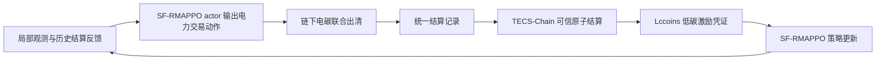

# 方法草稿

## 3 方法

### 3.1 可信电碳协同结算反馈框架总体设计

本文面向含分布式光伏、储能和柔性负荷的配电网 P2P 电碳联合交易场景，构建可信电碳协同结算反馈框架（Trusted Energy-Carbon Co-Settlement Feedback Framework, TECSF）。设配电网节点集合为 $\mathcal{B}$，产消者集合为 $\mathcal{N}$，交易时段集合为 $\mathcal{T}$。TECSF 由 SF-RMAPPO、链下电碳联合出清、TECS-Chain 和 Lccoins 组成，其作用不是替代常规 P2P 撮合，也不是将完整交易优化过程部署到真实区块链网络中，而是将电力出清、碳责任和低碳激励置于同一可审计结算状态下处理，使反馈给强化学习算法的低碳激励信号具有可核验来源。在时段 $t$，SF-RMAPPO actor 只输出购售电平均功率、报价和储能充放电功率；链下电碳联合出清模块通过双边拍卖形成 P2P 初始匹配，并在约束校核后得到最终成交量，再由电网补足未满足需求或吸收剩余电量，随后根据出清结果计算电网购电碳排放、光伏低碳贡献、碳配额自动购买量和剩余低碳贡献自动售卖量；上述结果被封装为统一结算记录并提交至 TECS-Chain，由结算状态机在同一事务中完成电量支付、碳责任、碳市场和 Lccoins 确认，若任一环节未通过校验，则本次结算状态整体回滚；已确认的结算结果和 Lccoins 反馈写入强化学习环境，用于下一轮状态更新和回报计算。因此，碳配额购买与剩余低碳贡献售卖不是强化学习的直接动作，而是由结算规则根据真实出清结果自动确定。



### 3.2 链下电碳联合出清模块

链下电碳联合出清模块是 TECSF 的支撑环节，用于将 SF-RMAPPO 输出的产消者动作转化为实际成交结果、配电网运行状态和主体碳责任。该部分采用常规交易匹配与约束校核流程，不作为本文的主要创新点；其作用是为后续可信协同结算和 Lccoins 激励提供一致、可核验的结算输入。若仅按智能体申报动作或合约电量直接结算，而不考虑配电网运行约束和碳责任，可能出现电量收益与实际物理消耗、碳排放责任相脱节的问题。

对产消者 $i$，记其在时段 $t$ 的负荷为 $d_{i,t}$，光伏出力为 $p^{\mathrm{pv}}_{i,t}$，储能荷电状态为 $s_{i,t}$。SF-RMAPPO 输出的动作记为 $a_{i,t}$，其中包含购电平均功率申报 $q^{\mathrm{buy}}_{i,t}$、售电平均功率申报 $q^{\mathrm{sell}}_{i,t}$、买卖报价 $\pi^{\mathrm{buy}}_{i,t}$ 和 $\pi^{\mathrm{sell}}_{i,t}$、储能充放电功率 $p^{\mathrm{ch}}_{i,t}$ 和 $p^{\mathrm{dis}}_{i,t}$。为保持功率平衡式量纲一致，本文将时段内购售电申报量和 P2P 成交量均折算为时段平均功率，结算电量为对应功率乘以 $\Delta t$。链下电碳联合出清模块首先根据所有智能体动作 $\mathbf{a}_t=\{a_{i,t}\}_{i\in\mathcal{N}}$ 执行双边拍卖：买方申报按照报价从高到低排序，卖方申报按照报价从低到高排序，在买方报价不低于卖方报价的条件下依次撮合，得到初始成交量 $\hat q_{ij,t}$ 和成交价格；随后对初始成交量进行约束校核和可行性修正，得到最终成交量 $q_{ij,t}$。由于 P2P 申报可能无法完全匹配，未满足的购电需求由电网补足，未被 P2P 消纳的剩余电量可向电网出售。若 $q_{ij,t}$ 表示产消者 $i$ 向产消者 $j$ 交易的平均功率，则产消者的净功率平衡可表示为

$$
p^{\mathrm{pv}}_{i,t}+p^{\mathrm{dis}}_{i,t}+\sum_{j\in\mathcal{N}} q_{ji,t}+p^{\mathrm{grid,buy}}_{i,t}
=d_{i,t}+p^{\mathrm{ch}}_{i,t}+\sum_{j\in\mathcal{N}} q_{ij,t}+p^{\mathrm{grid,sell}}_{i,t}.
$$

其中 $p^{\mathrm{grid,buy}}_{i,t}$ 和 $p^{\mathrm{grid,sell}}_{i,t}$ 分别表示产消者与电网之间的购电功率和售电功率。它们作为 P2P 匹配后的余缺平衡量，使产消者在 P2P 交易未完全匹配时仍能满足负荷需求：

$$
p^{\mathrm{grid,buy}}_{i,t}
=\left[d_{i,t}+p^{\mathrm{ch}}_{i,t}+\sum_{j\in\mathcal{N}}q_{ij,t}
-p^{\mathrm{pv}}_{i,t}-p^{\mathrm{dis}}_{i,t}-\sum_{j\in\mathcal{N}}q_{ji,t}\right]_+,
$$

$$
p^{\mathrm{grid,sell}}_{i,t}
=\left[p^{\mathrm{pv}}_{i,t}+p^{\mathrm{dis}}_{i,t}+\sum_{j\in\mathcal{N}}q_{ji,t}
-d_{i,t}-p^{\mathrm{ch}}_{i,t}-\sum_{j\in\mathcal{N}}q_{ij,t}\right]_+,
$$

其中 $[x]_+=\max(x,0)$。因此，P2P 双边拍卖决定本地交易部分，电网交易承担未匹配需求和剩余电量的兜底结算。

最终 P2P 成交量还需满足申报量约束：

$$
0\leq \sum_{j\in\mathcal{N}}q_{ji,t}\leq q^{\mathrm{buy}}_{i,t},\quad
0\leq \sum_{j\in\mathcal{N}}q_{ij,t}\leq q^{\mathrm{sell}}_{i,t}.
$$

储能运行满足荷电状态动态方程和容量边界：

$$
s_{i,t+1}=s_{i,t}+\eta^{\mathrm{ch}}_i p^{\mathrm{ch}}_{i,t}\Delta t-\frac{p^{\mathrm{dis}}_{i,t}\Delta t}{\eta^{\mathrm{dis}}_i},
$$

$$
s_i^{\min}\leq s_{i,t}\leq s_i^{\max},\quad
0\leq p^{\mathrm{ch}}_{i,t}\leq \bar p^{\mathrm{ch}}_i,\quad
0\leq p^{\mathrm{dis}}_{i,t}\leq \bar p^{\mathrm{dis}}_i.
$$

在本文框架中，购售电平均功率申报、报价和储能充放电功率由强化学习策略给出；链下电碳联合出清模块不是重新优化产消者的全部决策，而是在给定动作 $\mathbf{a}_t$ 的基础上执行“初始双边拍卖-可行性修正-结算量计算”的固定流程。若初始成交量 $\hat q_{ij,t}$ 导致配电网运行约束或储能运行边界不可行，模块优先削减造成越限的 P2P 成交量，并以最小化初始成交偏差为准则得到最终成交量：

$$
\min_{\mathbf{x}_t\,\mid\,\mathbf{a}_t}
\sum_{i,j\in\mathcal{N}}\left|q_{ij,t}-\hat q_{ij,t}\right|
+\rho_g\|\mathbf{g}_t\|_1,
$$

其中 $\mathbf{x}_t$ 为最终成交量、配网潮流、碳责任和必要松弛变量的集合，$\mathbf{g}_t$ 为约束违背量向量，$\rho_g$ 为违背惩罚系数。该修正过程受功率平衡、申报量边界、储能边界和配电网运行约束共同限制。若违背量超过给定容许阈值，则对应结算记录不进入 `Settled` 状态；若违背量在容许范围内，则 $\mathbf{g}_t$ 作为训练惩罚反馈给 SF-RMAPPO。

为保证交易结果满足配电网物理约束，链下电碳联合出清模块在成交量修正过程中引入线性化 DistFlow 或其他适用于径向配电网的潮流模型。设节点 $n$ 接入的产消者集合为 $\mathcal{N}_n$，则 P2P 成交和电网购售电对应的节点净注入可写为

$$
P^{\mathrm{inj}}_{n,t}
=\sum_{i\in\mathcal{N}_n}
\left(\sum_{j\in\mathcal{N}}q_{ij,t}+p^{\mathrm{grid,sell}}_{i,t}
-\sum_{j\in\mathcal{N}}q_{ji,t}-p^{\mathrm{grid,buy}}_{i,t}\right).
$$

对线路 $(m,n)\in\mathcal{L}$，记有功功率为 $P_{mn,t}$，无功功率为 $Q_{mn,t}$，节点电压平方为 $v_{n,t}$，则配电网运行约束可写为

$$
\sum_{m:(m,n)\in\mathcal{L}}P_{mn,t}
-\sum_{k:(n,k)\in\mathcal{L}}P_{nk,t}
=-P^{\mathrm{inj}}_{n,t},
$$

$$
v_{n,t}=v_{m,t}-2(r_{mn}P_{mn,t}+x_{mn}Q_{mn,t}),
$$

$$
v_n^{\min}\leq v_{n,t}\leq v_n^{\max},\quad
|P_{mn,t}|\leq \bar P_{mn}.
$$

若采用交流最优潮流、二阶锥松弛或其他潮流模型，上述约束可替换为相应的配电网约束形式。本文方法不依赖某一种特定潮流近似，关键要求是链下电碳联合出清模块能够输出可验证的约束校核结果，包括节点电压、线路潮流和约束违背量。

碳责任分摊在链下电碳联合出清模块中与电量交易结果同步计算。本文将产消者从电网购电产生的碳排放作为直接碳责任来源。记 $\gamma^{\mathrm{grid}}_t$ 为时段 $t$ 的电网排放因子，则产消者因电网购电产生的碳排放为

$$
e^{\mathrm{grid}}_{i,t}
=\gamma^{\mathrm{grid}}_t p^{\mathrm{grid,buy}}_{i,t}\Delta t.
$$

产消者自有光伏发电被视为相对于电网基准的清洁替代。为将其纳入统一电碳结算，本文设置光伏相对电网基准的碳抵扣因子为负值：

$$
\gamma^{\mathrm{pv}}_t=-\beta^{\mathrm{pv}}\gamma^{\mathrm{grid}}_t,\quad 0\leq \beta^{\mathrm{pv}}\leq 1,
$$

并将光伏消纳量对应的负碳抵扣表示为

$$
e^{\mathrm{pv,credit}}_{i,t}
=\gamma^{\mathrm{pv}}_t p^{\mathrm{pv,use}}_{i,t}\Delta t\leq 0,
$$

其中 $p^{\mathrm{pv,use}}_{i,t}$ 表示用于本地负荷、储能充电、P2P 外送或上网的光伏电量中被计入低碳贡献的部分，$\beta^{\mathrm{pv}}$ 为光伏相对电网基准的抵扣系数。当 $\beta^{\mathrm{pv}}=1$ 时，每单位光伏消纳电量抵扣一单位电网基准排放。由于产消者初始不持有碳配额，记初始碳配额为 $a^{0}_{i,t}=0$。光伏发电形成的可抵扣低碳贡献为

$$
c^{\mathrm{pv}}_{i,t}
=\left[-e^{\mathrm{pv,credit}}_{i,t}\right]_+.
$$

该低碳贡献优先用于抵消电网购电产生的碳配额需求：

$$
c^{\mathrm{offset}}_{i,t}
=\min(c^{\mathrm{pv}}_{i,t},e^{\mathrm{grid}}_{i,t}).
$$

扣除低碳贡献后的净碳配额需求为

$$
e^{\mathrm{ca,need}}_{i,t}
=\left[e^{\mathrm{grid}}_{i,t}-c^{\mathrm{offset}}_{i,t}-a^{0}_{i,t}\right]_+.
$$

本文假设碳市场能够按照结算需求完成自动成交，因此产消者在碳市场购买的碳配额为

$$
a^{\mathrm{buy}}_{i,t}=e^{\mathrm{ca,need}}_{i,t}.
$$

若低碳贡献抵消碳责任后仍有剩余，则剩余低碳贡献可以在碳市场中售卖：

$$
c^{\mathrm{sell}}_{i,t}
=\left[c^{\mathrm{pv}}_{i,t}-c^{\mathrm{offset}}_{i,t}\right]_+.
$$

据此，产消者的结算碳账户可写为

$$
e^{\mathrm{resp}}_{i,t}
=e^{\mathrm{grid}}_{i,t}-c^{\mathrm{offset}}_{i,t}-a^{\mathrm{buy}}_{i,t}.
$$

其中 $e^{\mathrm{grid}}_{i,t}$ 反映从电网购电需要承担的碳排放，$c^{\mathrm{offset}}_{i,t}$ 反映光伏低碳贡献对碳配额需求的抵消量，$e^{\mathrm{ca,need}}_{i,t}$ 为扣除低碳贡献后的净配额需求，$a^{\mathrm{buy}}_{i,t}$ 为自动购买的碳配额。在本文默认设定下，碳市场购买覆盖净配额需求，因此 $e^{\mathrm{resp}}_{i,t}=0$ 表示该时段碳责任已完成履约；$c^{\mathrm{sell}}_{i,t}$ 则作为可售低碳贡献进入碳市场收益结算。

该支撑环节最终输出统一出清包 $\mathcal{D}_t$：

$$
\mathcal{D}_t=
\{ \mathbf{Q}_t,\mathbf{\Pi}_t,\mathbf{P}^{\mathrm{grid,buy}}_t,\mathbf{P}^{\mathrm{grid,sell}}_t,
\mathbf{P}_t,\mathbf{V}_t,\mathbf{E}^{\mathrm{grid}}_t,\mathbf{E}^{\mathrm{pv,credit}}_t,
\mathbf{C}^{\mathrm{offset}}_t,\mathbf{E}^{\mathrm{ca,need}}_t,
\mathbf{A}^{\mathrm{buy}}_t,\mathbf{C}^{\mathrm{sell}}_t,
\mathbf{E}^{\mathrm{resp}}_t,\mathbf{E}^{\mathrm{lc}}_t,\mathbf{g}_t,h_t \},
$$

其中 $\mathbf{Q}_t$ 为 P2P 交易平均功率矩阵，结算电量为 $\mathbf{Q}_t\Delta t$；$\mathbf{\Pi}_t$ 为交易价格或支付矩阵，$\mathbf{P}^{\mathrm{grid,buy}}_t$ 和 $\mathbf{P}^{\mathrm{grid,sell}}_t$ 为电网购售电功率，$\mathbf{P}_t$ 和 $\mathbf{V}_t$ 分别为线路潮流与节点电压，$\mathbf{E}^{\mathrm{grid}}_t$ 为电网购电碳排放，$\mathbf{E}^{\mathrm{pv,credit}}_t$ 为光伏负碳抵扣，$\mathbf{C}^{\mathrm{offset}}_t$ 为低碳贡献抵扣量，$\mathbf{E}^{\mathrm{ca,need}}_t$ 为净碳配额需求，$\mathbf{A}^{\mathrm{buy}}_t$ 为碳市场购买配额，$\mathbf{C}^{\mathrm{sell}}_t$ 为可售低碳贡献，$\mathbf{E}^{\mathrm{resp}}_t$ 为履约后的剩余碳责任，$\mathbf{E}^{\mathrm{lc}}_t$ 为低碳贡献量，$\mathbf{g}_t$ 为约束违背量向量，$h_t$ 为出清包哈希。该出清包既是 TECS-Chain 可信协同结算的输入，也是 SF-RMAPPO 训练阶段使用的结算反馈来源。

### 3.3 TECS-Chain 可信原子协同结算状态机

TECS-Chain 是 TECSF 的可信结算确认层，用于将链下出清结果转化为可追溯、可校验且可回滚的结算状态。为避免与真实部署型区块链混淆，本文将 TECS-Chain 建模为链式结算状态机和本地可审计结算模拟器，而不涉及区块生成、P2P 节点同步、共识协议或智能合约虚拟机部署。该模块的设计动机是避免电量支付、碳责任确认和低碳激励凭证生成在不同系统中异步完成。若这些状态分别写入，产消者可能在电量收益已结算的情况下未完成碳责任确认，或在碳责任尚未确认时提前获得低碳激励。

每个时段的统一结算记录定义为

$$
\mathcal{R}_t=
\{ \mathrm{id}_t,\mathrm{epoch}_t,h_t,\mathcal{S}_t,
\mathcal{P}^{\mathrm{pay}}_t,\mathcal{E}^{\mathrm{resp}}_t,
\mathcal{M}^{\mathrm{lc}}_t,\sigma_t,\mathrm{state}_t \},
$$

其中 $\mathrm{id}_t$ 为结算记录编号，$\mathrm{epoch}_t$ 为交易轮次，$h_t$ 为链下出清包哈希，$\mathcal{S}_t$ 为参与主体及必要授权确认信息，$\mathcal{P}^{\mathrm{pay}}_t$ 为电量支付条目，$\mathcal{E}^{\mathrm{resp}}_t$ 为碳责任条目，可包含电网购电碳排放、光伏负碳抵扣、低碳贡献抵扣量、净碳配额需求、碳配额购买量、低碳贡献售卖量和履约后的剩余碳责任，$\mathcal{M}^{\mathrm{lc}}_t$ 为待生成 Lccoins 的低碳贡献条目，$\sigma_t$ 为可选签名、多签或授权确认信息，$\mathrm{state}_t$ 为结算状态。

TECS-Chain 结算状态机采用原子状态转换机制。结算记录首先进入 `Pending` 状态；状态机校验出清包哈希、参与者确认信息、时间戳、交易余额、碳责任条目、碳配额购买量、低碳贡献售卖量和配电网约束校核标识；校验通过后，记录进入 `Verified` 状态；随后结算状态机在同一事务中执行电量支付锁定、碳责任确认、碳市场结算和 Lccoins 凭证生成；全部操作成功后，状态更新为 `Settled`。若任一校验或执行环节失败，记录进入 `Rejected` 或 `Reverted` 状态，并撤销本次事务中已发生的中间状态变更。

该过程可表示为

$$
\mathrm{Pending}
\xrightarrow{\mathrm{Verify}(h_t,\sigma_t,\mathbf{g}_t)}
\mathrm{Verified}
\xrightarrow{\mathrm{Pay}+\mathrm{CarbonMarketSettle}+\mathrm{Mint}}
\mathrm{Settled}.
$$

为了降低结算层存储和隐私暴露，TECS-Chain 不直接存储完整潮流计算、报价曲线和主体隐私数据，而是存储统一结算记录、关键结算条目和链下数据哈希。需要审计时，监管方或授权参与者可根据哈希索引调取链下出清包，并验证其与结算记录的一致性。这样可以在保证结果可追溯的同时控制结算层数据规模。

TECS-Chain 的输出包括已确认结算记录、主体电量收益、主体碳市场结算结果、Lccoins 生成记录和结算状态。只有状态为 `Settled` 的记录才能进入强化学习反馈池；处于 `Rejected`、`Reverted` 或争议处理状态的记录不参与奖励更新。该规则保证 SF-RMAPPO 使用的低碳反馈来自最终确认的交易状态。

### 3.4 Lccoins 低碳激励凭证设计

Lccoins 是与已确认电碳结算结果显式绑定的低碳激励凭证，用于将光伏低碳电量和已用于抵扣碳配额需求的低碳贡献转化为可计量的收益调节信号。该模块解决的问题是：传统奖励函数中的低碳激励多由设计者预设，缺少与真实交易结算结果的一一对应关系；而 Lccoins 只在 TECS-Chain 完成可信原子协同结算后生成，因此能够把低碳贡献、结算状态和主体收益绑定起来。

对产消者 $i$，记其在时段 $t$ 的基准碳责任为 $e^{\mathrm{base}}_{i,t}$。该基准表示同等用电需求完全由电网供给时的碳排放，可写为

$$
e^{\mathrm{base}}_{i,t}
=\gamma^{\mathrm{grid}}_t p^{\mathrm{dem}}_{i,t}\Delta t,
$$

其中 $p^{\mathrm{dem}}_{i,t}$ 为需要被满足的用电需求，可根据算例设为负荷功率、负荷与储能充电功率之和，或其他一致的用电责任口径。实际结算中，产消者的电网购电碳排放为 $e^{\mathrm{grid}}_{i,t}$，光伏负碳抵扣为 $e^{\mathrm{pv,credit}}_{i,t}$。因此，由减少电网购电形成的碳责任降低量为

$$
\Delta e_{i,t}^{\mathrm{red}}
=\max(0,e^{\mathrm{base}}_{i,t}-e^{\mathrm{grid}}_{i,t}),
$$

该指标用于评价 P2P 交易和光伏消纳对电网购电碳排放的降低效果。为避免同一低碳贡献同时获得碳市场售卖收益和 Lccoins 激励，Lccoins 仅根据光伏低碳电量及已用于抵扣碳配额需求的部分生成；剩余低碳贡献 $c^{\mathrm{sell}}_{i,t}$ 只进入碳市场收益结算。

光伏相对于电网基准形成的低碳贡献为

$$
c^{\mathrm{pv}}_{i,t}
=\left[-e^{\mathrm{pv,credit}}_{i,t}\right]_+,
$$

该低碳贡献在结算中首先用于抵消碳配额需求，剩余部分可在碳市场出售：

$$
c^{\mathrm{offset}}_{i,t}
=\min(c^{\mathrm{pv}}_{i,t},e^{\mathrm{grid}}_{i,t}),
\quad
c^{\mathrm{sell}}_{i,t}
=\left[c^{\mathrm{pv}}_{i,t}-c^{\mathrm{offset}}_{i,t}\right]_+.
$$

低碳电量贡献记为

$$
q^{\mathrm{lc}}_{i,t}=p^{\mathrm{pv,use}}_{i,t}\Delta t.
$$

据此，Lccoins 生成量定义为

$$
\ell_{i,t}
=\alpha_1 \phi_q(q^{\mathrm{lc}}_{i,t})
+\alpha_2 \phi_o(c^{\mathrm{offset}}_{i,t}),
$$

其中 $\ell_{i,t}$ 为产消者 $i$ 在时段 $t$ 获得的 Lccoins 数量，$\alpha_1$ 和 $\alpha_2$ 为低碳激励权重，$\phi_q(\cdot)$ 和 $\phi_o(\cdot)$ 为归一化函数。该定义使 Lccoins 同时反映光伏清洁电量消纳和低碳贡献对碳配额需求的抵消效果，而不重复奖励已经售卖的剩余低碳贡献。具体基准场景应与实验对照组保持一致。

Lccoins 的生成遵循三条规则。第一，凭证生成必须以 `Settled` 状态的统一结算记录为依据，未确认或回滚的结算记录不产生 Lccoins。第二，同一低碳贡献条目只能被铸造一次，结算状态机通过结算记录编号、主体编号和时段编号防止重复生成。第三，Lccoins 是本时段结算完成后的激励反馈，不参与本时段碳配额抵扣或剩余低碳贡献售卖；碳配额抵扣和低碳贡献售卖已由链下电碳联合出清模块根据 $c^{\mathrm{offset}}_{i,t}$ 和 $c^{\mathrm{sell}}_{i,t}$ 自动完成。其兑换规则必须在实验前固定，避免在训练过程中引入人为变化的奖励信号。

在收益结算中，Lccoins 对产消者收益的调节可写为

$$
R^{\mathrm{lc}}_{i,t}=\kappa_t \ell_{i,t},
$$

其中 $\kappa_t$ 为 Lccoins 的单位价值或奖励换算系数。该项作为策略学习中的低碳激励反馈，不计入碳市场净成本 $C^{\mathrm{carbon}}_{i,t}$。本文默认在基准方法比较中保持 $\kappa_t$ 和 $\alpha$ 系数固定，以便识别 Lccoins 机制本身对交易行为和学习收敛的影响。

### 3.5 结算反馈驱动的 SF-RMAPPO 算法

为刻画产消者在不确定环境下的连续决策过程，本文将 P2P 电碳联合交易建模为部分可观测多智能体马尔可夫决策过程。每个产消者为一个智能体，采用集中训练、分散执行框架。分散执行阶段，智能体仅基于自身可观测信息和历史隐藏状态输出交易动作；集中训练阶段，critic 可使用上一时段已确认的全局出清结果、配电网约束状态、碳责任分摊和 Lccoins 反馈。当前时段的结算结果只用于回报计算和下一时段状态更新，不作为 actor 决策前的输入。

产消者 $i$ 在时段 $t$ 的局部观测可表示为

$$
o_{i,t}=
\{d_{i,t},p^{\mathrm{pv}}_{i,t},s_{i,t},\lambda^{\mathrm{buy}}_t,\lambda^{\mathrm{sell}}_t,
\gamma^{\mathrm{grid}}_{t-1},e^{\mathrm{grid}}_{i,t-1},
e^{\mathrm{pv,credit}}_{i,t-1},c^{\mathrm{offset}}_{i,t-1},
a^{\mathrm{buy}}_{i,t-1},c^{\mathrm{sell}}_{i,t-1},
e^{\mathrm{resp}}_{i,t-1},\ell_{i,t-1},a_{i,t-1}\},
$$

其中 $\lambda^{\mathrm{buy}}_t$ 和 $\lambda^{\mathrm{sell}}_t$ 为购售电价格信号，$\gamma^{\mathrm{grid}}_{t-1}$ 为上一轮电网排放因子，$e^{\mathrm{grid}}_{i,t-1}$、$e^{\mathrm{pv,credit}}_{i,t-1}$、$c^{\mathrm{offset}}_{i,t-1}$、$a^{\mathrm{buy}}_{i,t-1}$、$c^{\mathrm{sell}}_{i,t-1}$、$e^{\mathrm{resp}}_{i,t-1}$ 和 $\ell_{i,t-1}$ 分别为上一轮已确认的电网购电碳排放、光伏负碳抵扣、低碳贡献抵扣量、碳配额购买量、低碳贡献售卖量、履约后剩余碳责任和 Lccoins 反馈，$a_{i,t-1}$ 为上一轮动作。动作 $a_{i,t}$ 由 SF-RMAPPO actor 直接输出，可写为

$$
a_{i,t}=
\{q^{\mathrm{buy}}_{i,t},q^{\mathrm{sell}}_{i,t},
\pi^{\mathrm{buy}}_{i,t},\pi^{\mathrm{sell}}_{i,t},
p^{\mathrm{ch}}_{i,t},p^{\mathrm{dis}}_{i,t}\}.
$$

其中 $q^{\mathrm{buy}}_{i,t}$ 和 $q^{\mathrm{sell}}_{i,t}$ 为购售电平均功率申报，$\pi^{\mathrm{buy}}_{i,t}$ 和 $\pi^{\mathrm{sell}}_{i,t}$ 为买卖报价，$p^{\mathrm{ch}}_{i,t}$ 和 $p^{\mathrm{dis}}_{i,t}$ 为储能充放电功率。碳配额购买量 $a^{\mathrm{buy}}_{i,t}$ 和剩余低碳贡献售卖量 $c^{\mathrm{sell}}_{i,t}$ 不作为 actor 的动作，而是由链下电碳联合出清模块在电力交易结果确定后，根据电网购电碳排放、光伏低碳贡献和碳市场规则自动结算得到。

由于负荷、光伏出力和结算反馈均具有时序相关性，本文在 MAPPO 中引入循环策略网络，形成 SF-RMAPPO。对每个智能体，actor 使用 GRU 或 LSTM 更新隐藏状态：

$$
h_{i,t}=f_{\theta}^{\mathrm{rec}}(o_{i,t},h_{i,t-1}),
\quad
a_{i,t}\sim \pi_{\theta_i}(a_{i,t}|h_{i,t}).
$$

集中式 critic 输入全局状态 $s_t^{\mathrm{g}}$，包括当前产消者观测和上一时段已确认的链下出清结果、配电网约束违背量、电网购电碳排放、光伏负碳抵扣、低碳贡献抵扣量、碳配额购买量、低碳贡献售卖量、履约后剩余碳责任和 Lccoins 反馈：

$$
V_{\psi}(s_t^{\mathrm{g}})=
V_{\psi}(\mathbf{o}_t,\mathbf{Q}_{t-1},\mathbf{P}^{\mathrm{grid,buy}}_{t-1},
\mathbf{P}^{\mathrm{grid,sell}}_{t-1},\mathbf{V}_{t-1},\mathbf{E}^{\mathrm{grid}}_{t-1},
\mathbf{E}^{\mathrm{pv,credit}}_{t-1},\mathbf{C}^{\mathrm{offset}}_{t-1},
\mathbf{A}^{\mathrm{buy}}_{t-1},\mathbf{C}^{\mathrm{sell}}_{t-1},
\mathbf{E}^{\mathrm{resp}}_{t-1},\boldsymbol{\ell}_{t-1},\mathbf{g}_{t-1}).
$$

产消者 $i$ 的即时回报由经济收益、碳责任成本、Lccoins 激励和约束惩罚组成：

$$
r_{i,t}
=R^{\mathrm{energy}}_{i,t}
-C^{\mathrm{op}}_{i,t}
-C^{\mathrm{carbon}}_{i,t}
+R^{\mathrm{lc}}_{i,t}
-\sum_{k} \mu_{k,t} G_{k,t},
$$

其中 $R^{\mathrm{energy}}_{i,t}$ 为电量交易收益，$C^{\mathrm{op}}_{i,t}$ 为本地运行成本，$C^{\mathrm{carbon}}_{i,t}$ 为碳市场净成本，$R^{\mathrm{lc}}_{i,t}$ 为 Lccoins 对应的低碳收益，$G_{k,t}$ 为第 $k$ 类约束违背量，$\mu_{k,t}$ 为对应的拉格朗日乘子。由于产消者初始碳配额为零，碳市场净成本可写为

$$
C^{\mathrm{carbon}}_{i,t}
=\lambda^{\mathrm{ca,buy}}_t a^{\mathrm{buy}}_{i,t}
-\lambda^{\mathrm{lc,sell}}_t c^{\mathrm{sell}}_{i,t},
$$

其中 $\lambda^{\mathrm{ca,buy}}_t$ 为碳配额购买价格，$\lambda^{\mathrm{lc,sell}}_t$ 为剩余低碳贡献的售卖价格。由于碳配额购买由结算模块按净配额需求自动完成，$C^{\mathrm{carbon}}_{i,t}$ 表示实际发生的碳市场净成本；约束项主要覆盖节点电压越限、线路容量越限、储能荷电状态越界和交易功率边界等。

拉格朗日乘子采用投影次梯度方式更新：

$$
\mu_{k,t+1}=
\left[\mu_{k,t}+\eta_{\mu} G_{k,t}\right]_+,
$$

其中 $\eta_{\mu}$ 为乘子更新步长，$[\cdot]_+$ 表示非负投影。该设计使强化学习过程不只通过固定惩罚系数处理约束，而是根据约束违背程度动态调整惩罚强度。

策略更新采用 PPO 的截断目标函数。记

$$
\varrho_{i,t}(\theta)=
\frac{\pi_{\theta_i}(a_{i,t}|h_{i,t})}
{\pi_{\theta_i^{\mathrm{old}}}(a_{i,t}|h_{i,t})},
$$

则 actor 的优化目标为

$$
\mathcal{L}^{\mathrm{clip}}(\theta)=
\mathbb{E}_t
\left[
\min\left(
\varrho_{i,t}(\theta)\hat A_{i,t},
\mathrm{clip}(\varrho_{i,t}(\theta),1-\epsilon,1+\epsilon)\hat A_{i,t}
\right)
\right],
$$

其中 $\hat A_{i,t}$ 由广义优势估计计算。critic 通过最小化价值函数误差更新：

$$
\mathcal{L}^{V}(\psi)=
\mathbb{E}_t\left[
\left(V_{\psi}(s_t^{\mathrm{g}})-\hat R_t\right)^2
\right].
$$

SF-RMAPPO 的训练流程如下。

```text
算法 1：SF-RMAPPO 结算反馈学习
输入：产消者集合、配电网参数、训练时段、TECSF 结算接口、初始策略参数
输出：产消者分散执行策略
1. 初始化 actor、centralized critic、循环隐藏状态和拉格朗日乘子
2. 对每个训练 episode：
3.   对每个交易时段 t：
4.     各产消者的 SF-RMAPPO actor 根据局部观测和隐藏状态输出购售电平均功率、报价和储能充放电动作
5.     链下电碳联合出清模块执行双边拍卖、成交量可行性修正，并同步进行碳配额购买和剩余低碳贡献售卖结算
6.     TECS-Chain 结算状态机对统一结算记录进行可信原子协同结算
7.     若结算状态为 Settled，则生成 Lccoins 并写入反馈池
8.     根据电量收益、碳配额购买成本、低碳贡献售卖收益、Lccoins 和约束违背量计算回报
9.     存储观测、动作、回报、下一时段观测、全局状态、隐藏状态和已确认结算反馈
10.  使用 GAE 计算优势函数和回报目标
11.  更新 centralized critic 和各智能体 actor
12.  根据约束违背量更新拉格朗日乘子
13. 返回训练后的分散执行策略
```

与普通 MAPPO 相比，SF-RMAPPO 的关键差异在于两点。第一，低碳奖励不直接来自预设环境参数，而是来自 TECS-Chain 已确认结算记录所生成的 Lccoins；第二，critic 显式接收上一时段已确认的电碳出清结果、碳责任分摊和配电网约束状态，从而能够学习交易动作、运行约束和低碳反馈之间的耦合关系，同时避免将当前时段结算结果提前泄露给 actor。

### 3.6 对比方法、消融实验与评价指标

为验证 TECSF 的有效性，实验将在典型配电网 P2P 交易场景中开展。算例系统、节点规模、产消者接入位置、时间分辨率、光伏和负荷数据来源、储能容量、电价和碳价参数在实验设置中统一给定，并在所有对比方法和消融方法中保持一致。本节定义对比协议、消融设计和评价指标。

对比方法包括以下几类。第一，无电碳协同结算方法，即仅进行 P2P 电量交易和电量支付，不将碳责任与电量收益同步确认。第二，无 Lccoins 激励方法，即保留电碳联合出清和碳责任分摊，但不生成结算锚定的低碳激励凭证。第三，普通 MAPPO 方法，即使用常规多智能体 PPO 奖励设计，不引入循环网络和结算反馈。第四，无拉格朗日约束项方法，即用固定惩罚或不显式处理网络安全与碳排放约束。第五，集中式优化或传统启发式交易策略，用作非强化学习基线。

消融实验用于识别各模块的独立贡献。具体包括：移除 TECS-Chain 可信原子协同结算以检验可信结算对收益和责任一致性的影响；移除 Lccoins 以检验结算锚定激励对低碳交易行为的影响；移除结算反馈输入以检验真实结算状态对策略学习的作用；移除循环网络以检验时序状态建模对收敛和决策质量的影响；移除拉格朗日约束项以检验约束处理机制对网络安全和碳排放控制的影响。

评价指标从经济性、低碳性、公平性、可信结算和学习性能五个方面设置。经济性指标包括系统总运行成本、主体平均收益、P2P 成交电量和主网购电成本。低碳性指标包括系统碳排放总量、电网购电碳排放、光伏负碳抵扣、净碳配额需求、碳配额购买量、低碳贡献售卖量、碳责任降低量和可再生能源消纳率。公平性指标可采用主体收益分布、碳责任分摊偏差、低碳贡献与激励匹配度等。可信结算指标包括结算成功率、回滚次数、结算确认延迟、结算层存储开销和凭证重复生成率。学习性能指标包括 episode 回报、收敛轮数、策略波动程度和约束违背次数。

本文预期通过上述对比和消融分析回答三个问题：TECSF 是否能够在满足配电网运行约束的同时降低运行成本、电网购电碳排放和净碳配额需求；Lccoins 是否能够将已确认低碳贡献转化为稳定的策略学习信号；SF-RMAPPO 是否能够比普通 MAPPO 更好地处理结算反馈滞后、主体耦合和运行约束。具体量化结果将在实验结果部分报告。

### 3.7 实现细节与参数设置

方法实现包括链下双边拍卖撮合与约束校核、TECS-Chain 本地结算状态机和强化学习训练三部分。链下撮合规则在仿真环境中实现，其输入为 SF-RMAPPO 已生成的产消者电力交易动作；TECS-Chain 以本地可审计结算模拟器实现统一结算记录、哈希校验、状态转换、原子回滚和 Lccoins 生成，不包含真实区块生成、P2P 节点同步或共识协议；SF-RMAPPO 基于深度学习框架实现循环 actor、集中式 critic 和 PPO 更新。

为保证实验可复现，实验设置需明确以下参数：配电网拓扑和线路参数；产消者数量及其接入节点；光伏、负荷和电价数据来源；储能容量、效率和功率边界；电网排放因子、光伏相对电网基准的碳抵扣系数、初始碳配额、碳配额购买价格、低碳贡献售卖价格和碳价设置；Lccoins 权重 $\alpha_1,\alpha_2$ 与奖励换算系数 $\kappa_t$；actor 和 critic 的网络结构、隐藏层维度、循环单元类型、学习率、折扣因子、GAE 参数、PPO 截断参数、batch size、训练 episode 数和随机种子；TECS-Chain 的结算确认规则、确认阈值、结算记录字段、哈希校验方式和状态机执行规则。

上述参数不改变 TECSF 的模块逻辑，但会影响实验数值结果和结论强度。为保证比较公平，基线方法、消融方法和所提方法使用相同的数据集、训练轮次、随机种子设置和约束条件。
